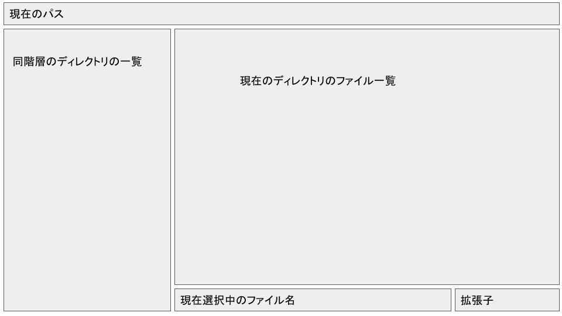

## メモ
- ターミナルベースのファイルダイアログが欲しい
- 操作は簡単
- WindowsでもLinuxでも両方動作するものが欲しい
- ターミナル上で動くプログラムが前提
- GUIベースのプログラムでも実装できないか

## 設計

- 上下 同階層のポインタ移動
- 左 親ディレクトリへ
- 右 ディレクトリに入る
- tab コンテナの移動
- Enter ディレクトリなら入る ファイルなら選択
